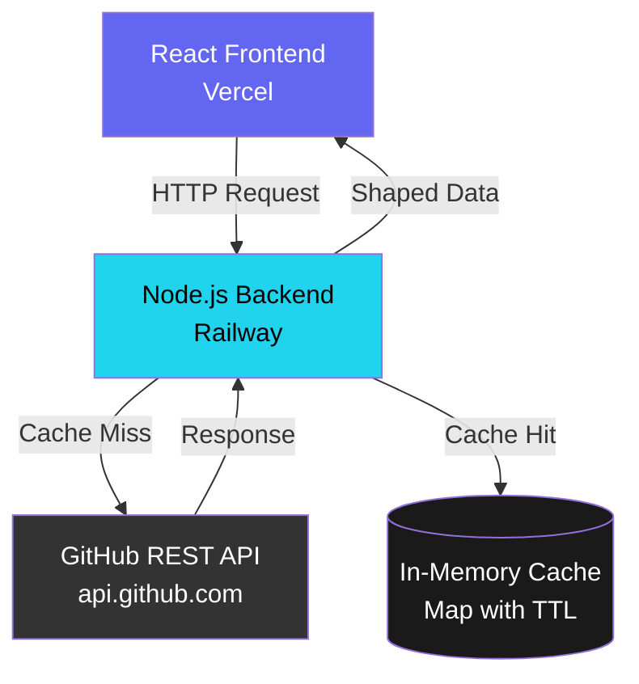
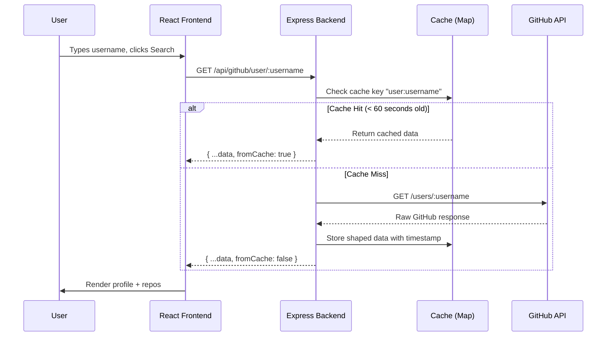
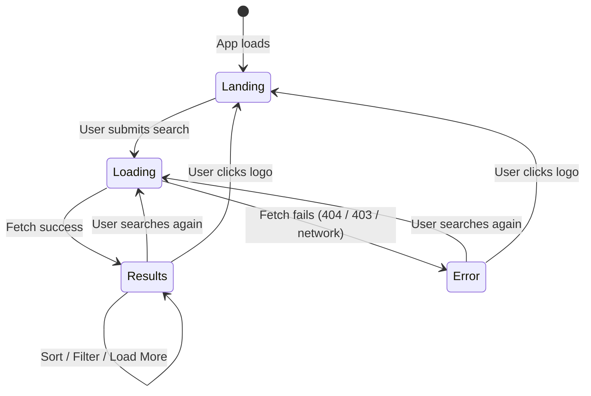
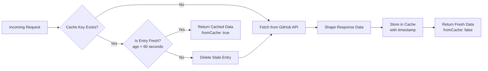

# GitExplorer

A full-stack GitHub profile and repository explorer built with React and Node.js. Search any GitHub username to explore their public profile, repositories, language distribution, and more — all proxied through a caching backend.

---

## Exercise

**Exercise 3: GitHub Repository Explorer** 

The app allows users to search any GitHub username and explore their public profile, repositories, and language distribution. All GitHub API requests are proxied through a Node.js backend to enable server-side caching and keep the GitHub personal access token out of the browser.

I chose this exercise because it had the most to learn from — the proxy pattern, server-side caching with TTL, third-party API integration, rate limit handling, and pagination are concepts I wanted to understand deeply, not just implement. Working through each layer of this stack gave me a much clearer mental model of how real full-stack applications are structured.

---

## Live Demo
- **Frontend:** https://github-explorer-psi-three.vercel.app
- **Backend API:** https://github-explorer-production-65d4.up.railway.app/health

---

## Architecture



---

## Request Flow



---

## Frontend State Machine



---

## Caching Strategy



---

## Project Structure

```
github-explorer/
├── README.md
│
├── server/                          ← Node.js + Express backend
│   ├── src/
│   │   ├── index.js                 ← Entry point, middleware, server
│   │   ├── routes/
│   │   │   └── github.js            ← Proxy route handlers
│   │   ├── services/
│   │   │   └── githubService.js     ← GitHub API calls + data shaping
│   │   └── cache/
│   │       └── inMemoryCache.js     ← TTL cache (Map)
│   ├── .env                         ← Not committed
│   └── package.json
│
└── client/                          ← React + Vite frontend
    ├── src/
    │   ├── App.jsx                  ← Root orchestrator component
    │   ├── App.module.css           ← Root layout styles
    │   ├── index.css                ← Global CSS design tokens
    │   ├── api/
    │   │   └── client.js            ← Axios instance for backend
    │   ├── hooks/
    │   │   ├── useGithubSearch.js   ← useReducer + all fetch logic
    │   │   └── useRecentSearches.js ← localStorage recent searches
    │   └── components/
    │       ├── SearchBar.jsx        ← Search input + animations
    │       ├── UserProfile.jsx      ← Profile card
    │       ├── RepoList.jsx         ← Sort + filter + grid + pagination
    │       ├── RepoCard.jsx         ← Repo card with expand/collapse
    │       ├── LanguageChart.jsx    ← Recharts bar chart
    │       ├── RecentSearches.jsx   ← Recent search chips
    │       └── SkeletonLoader.jsx   ← Loading placeholders
    ├── .env                         ← Not committed
    └── package.json
```

---

## Tech Stack

| Layer | Technology | Why |
|---|---|---|
| Frontend | React 18 + Vite | Fast builds, modern hooks-based React |
| Styling | CSS Modules | Scoped styles, no class name conflicts |
| Animation | Framer Motion | Smooth enter/exit animations, stagger effects |
| Charts | Recharts | React-native SVG charting |
| HTTP Client | Axios | Cleaner API calls, consistent error handling |
| Backend | Node.js + Express v4 | Lightweight REST API |
| Caching | In-memory Map | TTL-based, no database needed |
| GitHub API | REST API v3 | Public profile and repo data |
| Deployment | Vercel + Railway | Free tier, GitHub integration |

---

## How to Run Locally

Clone the repo:

```bash
git clone https://github.com/shalini31102/github-explorer.git
cd github-explorer
```

### Backend

```bash
cd server
npm install
```

Create `server/.env`:
```
PORT=5000
GITHUB_TOKEN=your_github_personal_access_token
CLIENT_URL=http://localhost:5173
```

Get a token: GitHub → Settings → Developer Settings → Personal Access Tokens → Generate (classic) → check `public_repo`.

```bash
npm run dev
# Server runs on http://localhost:5000
```

### Frontend

Open a new terminal:

```bash
cd client
npm install
```

Create `client/.env`:
```
VITE_API_URL=http://localhost:5000/api
```

```bash
npm run dev
# App runs on http://localhost:5173
```

---

## API Documentation

Base URL: `https://github-explorer-production-65d4.up.railway.app/api`

### GET /github/user/:username

Fetches a GitHub user's public profile.

| Parameter | Type | Description |
|---|---|---|
| `username` | path | GitHub username |

**Success Response (200):**
```json
{
  "login": "torvalds",
  "name": "Linus Torvalds",
  "bio": null,
  "avatarUrl": "https://avatars.githubusercontent.com/u/1024025?v=4",
  "followers": 306000,
  "following": 0,
  "publicRepos": 12,
  "htmlUrl": "https://github.com/torvalds",
  "location": "Portland, OR",
  "company": "Linux Foundation",
  "fromCache": false
}
```

**Error Responses:**

| Status | Meaning |
|---|---|
| `404` | GitHub user not found |
| `403` | GitHub API rate limit exceeded |
| `500` | Unexpected server error |

---

### GET /github/user/:username/repos

Fetches a paginated list of public repositories.

| Parameter | Type | Description |
|---|---|---|
| `username` | path | GitHub username |
| `page` | query (optional) | Page number, default 1 |

**Success Response (200):**
```json
{
  "repos": [
    {
      "id": 2325298,
      "name": "linux",
      "description": "Linux kernel source tree",
      "language": "C",
      "stars": 235000,
      "forks": 62000,
      "openIssues": 3,
      "defaultBranch": "master",
      "updatedAt": "2026-06-07T08:45:09Z",
      "htmlUrl": "https://github.com/torvalds/linux",
      "topics": []
    }
  ],
  "hasMore": false,
  "fromCache": false
}
```

---

### GET /health

Health check endpoint.

**Success Response (200):**
```json
{
  "status": "ok",
  "timestamp": "2026-06-08T10:00:00.000Z"
}
```

---

## Features

- Search GitHub username → view public profile
- Display avatar, name, bio, location, company, followers, following, repo count
- List public repos: name, description, language dot, stars, forks, last updated
- Sort by stars, name, or last updated
- Handle 404 (user not found) and 403 (rate limit) gracefully
- Handle network errors
- Server-side caching — 60s TTL, in-memory Map
- Skeleton loading states during fetch
- Pagination — Load More button, 30 repos per page
- Click repo to expand — shows open issues and default branch
- Recently searched usernames — persisted in localStorage, max 5
- Client-side repo filter by name — instant, no API call
- Language distribution bar chart (Recharts) — updates as more repos load
- Error boundary — catches unexpected crashes and shows a recovery UI instead of blank screen

---

## Key Design Decisions

**Why proxy through the backend?**
Two reasons: (1) the GitHub token stays server-side and never reaches the browser, and (2) caching is only possible when requests go through our backend.

**Why in-memory cache over Redis/SQLite?**
The brief explicitly allowed in-memory cache. A Map with TTL is sufficient for this scale and requires zero infrastructure.

**Why `useReducer` over multiple `useState` calls?**
Multiple state values change atomically (loading + error + data). `useReducer` prevents inconsistent intermediate states and makes state transitions explicit and traceable.

**Why sort and filter client-side?**
All repos are already in memory after fetching. Sorting is O(n log n) on the client — no reason to make an API call. Filter is O(n) string matching — instant.

**Why CSS Modules over Tailwind?**
Scoped styles with no class conflicts. The design system is token-based (CSS variables) so consistency is maintained without a utility framework. Reviewers can easily trace styles to their component.

---

## Next Steps

Given more time I would add:

- **Persistent cache** — Redis or SQLite so cache survives server restarts
- **User GitHub token** — Let users provide their own token for 5000 req/hour
- **Debounced search** — Search-as-you-type with 500ms debounce. Intentionally skipped because it would burn through GitHub's rate limit quickly even with caching — a search fires on every pause while typing.
- **Unit tests** — Jest tests for cache module and route handlers
- **E2E tests** — Playwright for the full search → results → expand flow

---

## Git Commit History

This project was committed incrementally following conventional commits:

```
feat:  new feature
fix:   bug fix
style: CSS/styling changes
chore: setup, config, tooling
docs:  documentation
```

---

## AI Usage Disclosure

This project was built with assistance from Claude (Anthropic) for code generation, architectural guidance, and debugging. Every line of code has been reviewed and understood.

---

## Author

**Shalini Sharma**
GitHub: [@shalini31102](https://github.com/shalini31102)
